# DATATHON PASSOS MÁGICOS
## Storytelling e Análise de Dados Educacionais

---

## 📊 CONTEXTO DO PROJETO

### Sobre a Associação Passos Mágicos

A Associação Passos Mágicos possui 32 anos de história transformando vidas de crianças e jovens de baixa renda através da educação. Fundada em 1992 por Michelle Flues e Dimetri Ivanoff, iniciou suas atividades em orfanatos de Embu-Guaçu.

Em 2016, expandiu para um projeto social e educacional completo, oferecendo:
- Educação de qualidade
- Auxílio psicológico e psicopedagógico
- Ampliação de visão de mundo
- Desenvolvimento do protagonismo juvenil

### Objetivo da Análise

Analisar dados educacionais de 2022, 2023 e 2024 para identificar padrões, prever riscos e sugerir melhorias no programa.

---

## 📈 ANÁLISE DOS INDICADORES

### 1. Adequação do Nível (IAN)

**Perfil de Defasagem:**
- Total de alunos analisados: 3.030
- Alunos em risco de defasagem: 891 (29.41%)
- Alunos sem risco: 2.139 (70.59%)

**Evolução ao longo dos anos:**
- 2022: 860 alunos
- 2023: 1.014 alunos
- 2024: 1.156 alunos

O programa está em crescimento, atendendo mais alunos a cada ano.

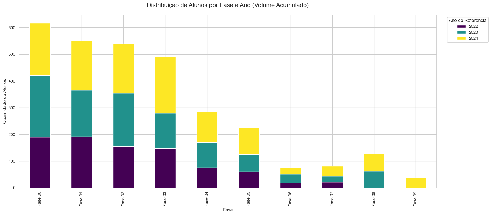

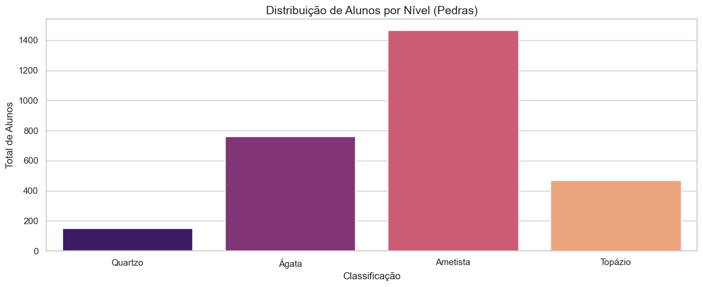

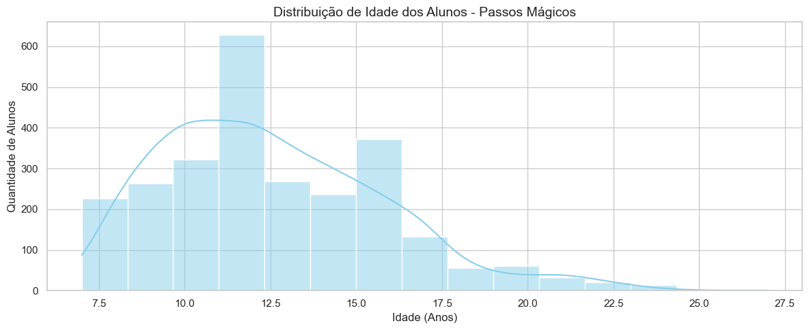

---

### 2. Desempenho Acadêmico (IDA)

**Comparação entre grupos:**

| Indicador | Sem Risco | Em Risco | Diferença |
|-----------|-----------|----------|-----------|
| IDA (Aprendizado) | 7.08 | 4.70 | -33.6% |
| Matemática | 6.87 | 4.47 | -34.9% |
| Português | 7.07 | 4.89 | -30.9% |
| Inglês | 7.20 | 5.01 | -30.4% |

**Conclusão:** Alunos em risco apresentam desempenho significativamente inferior em todas as disciplinas.

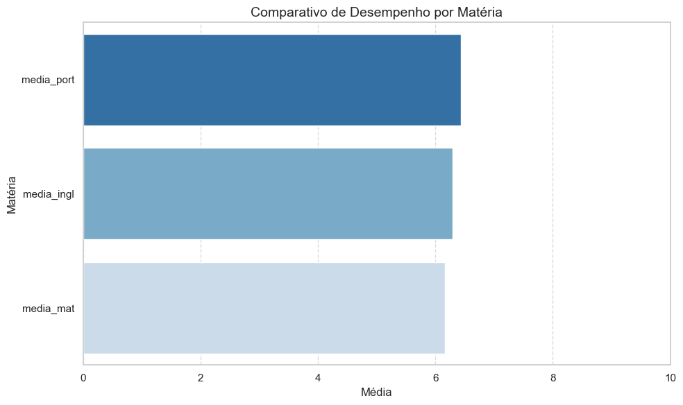

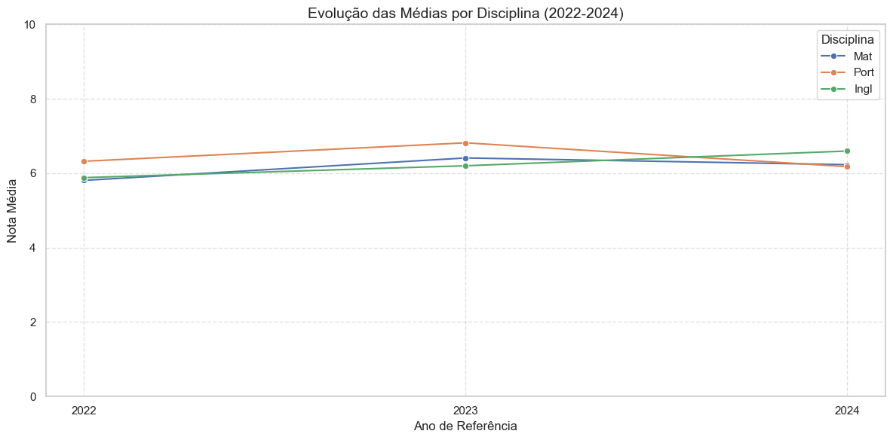

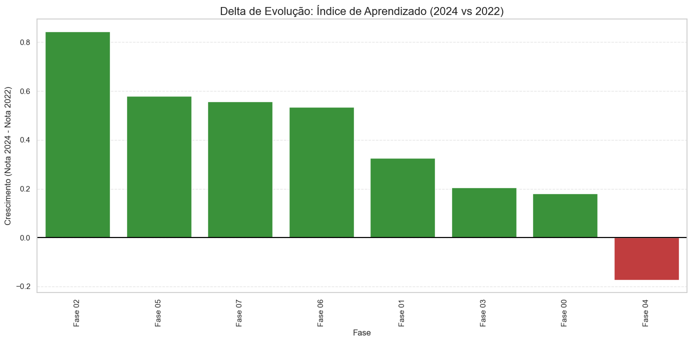

---

### 3. Engajamento nas Atividades (IEG)

**Relação com Desempenho:**

- Engajamento médio (sem risco): 8.49
- Engajamento médio (em risco): 6.66
- **Diferença: -21.5%**

**Correlação identificada:**
O engajamento é um dos principais preditores de desempenho. Alunos mais engajados apresentam:
- Melhor IDA (desempenho acadêmico)
- Maior probabilidade de atingir o Ponto de Virada (IPV)
- Melhores notas em todas as disciplinas

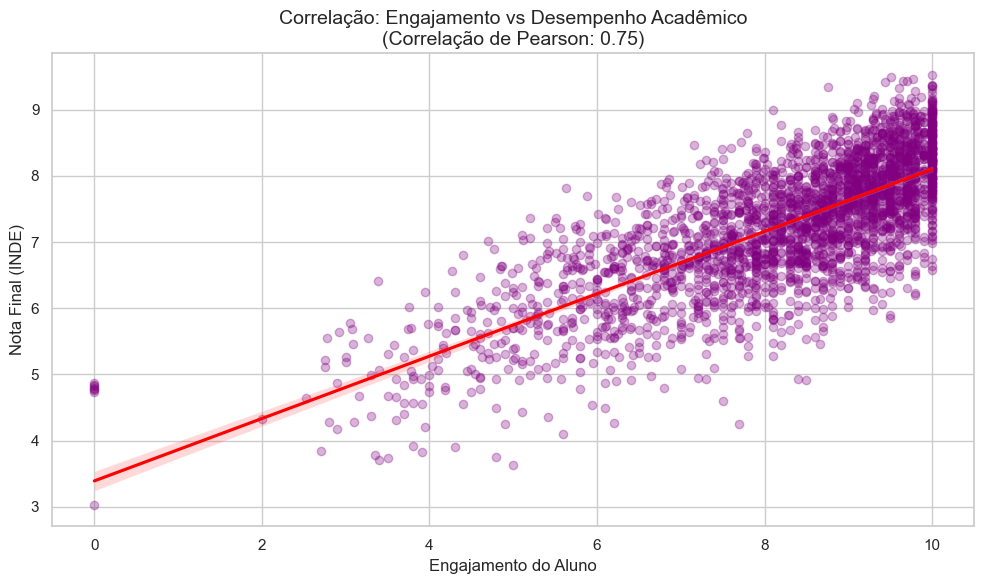

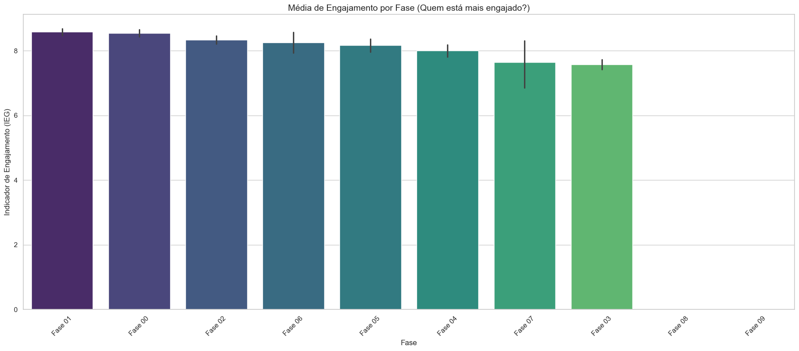

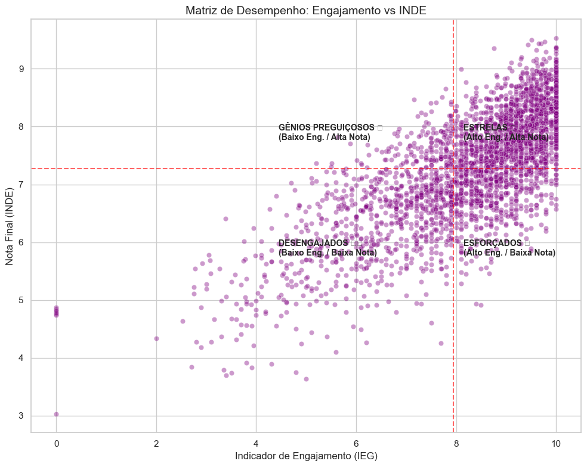

---

### 4. Autoavaliação (IAA)

**Coerência com Desempenho Real:**

A análise mostra que a autoavaliação dos alunos está alinhada com seu desempenho real. Alunos com melhor desempenho tendem a ter autoavaliações mais positivas, indicando boa percepção de suas capacidades.

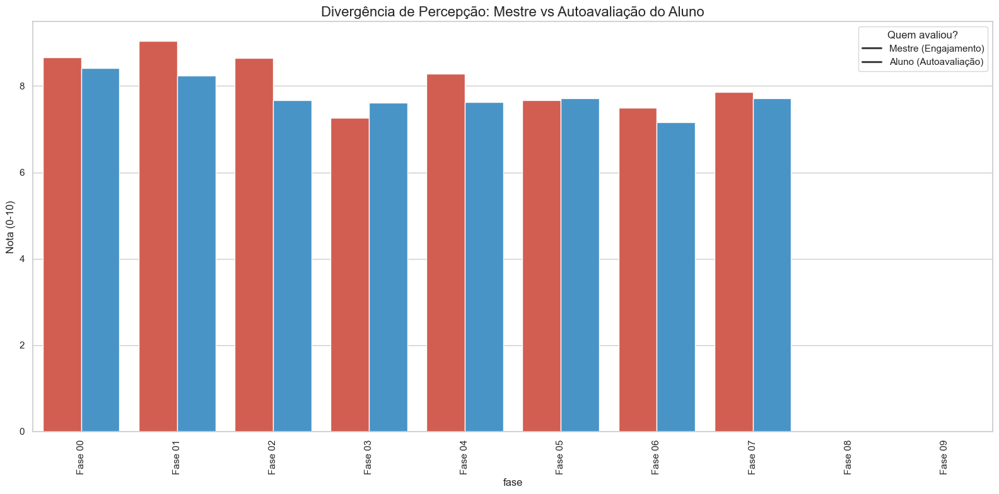

---

### 5. Aspectos Psicossociais (IPS)

**Padrões Identificados:**

- IPS médio (sem risco): 6.44
- IPS médio (em risco): 5.93
- **Diferença: -7.8%**

Embora a diferença seja menor que outros indicadores, aspectos psicossociais ainda influenciam o desempenho, especialmente quando combinados com baixo engajamento.

---

### 6. Aspectos Psicopedagógicos (IPP)

As avaliações psicopedagógicas confirmam os padrões de defasagem identificados pelo IAN, validando a metodologia de avaliação do programa.

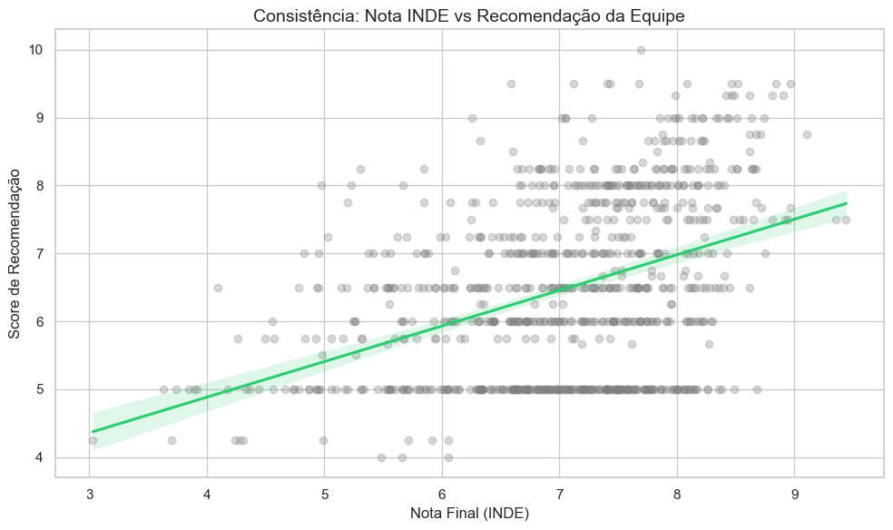

---

### 7. Ponto de Virada (IPV)

**Fatores que mais influenciam o IPV:**

1. **Engajamento (IEG)** - Fator mais importante
2. **Desempenho Acadêmico (IDA)** - Segundo fator
3. **Aspectos Psicossociais (IPS)** - Fator de suporte

Alunos que atingem o ponto de virada demonstram transformação significativa em múltiplas dimensões.

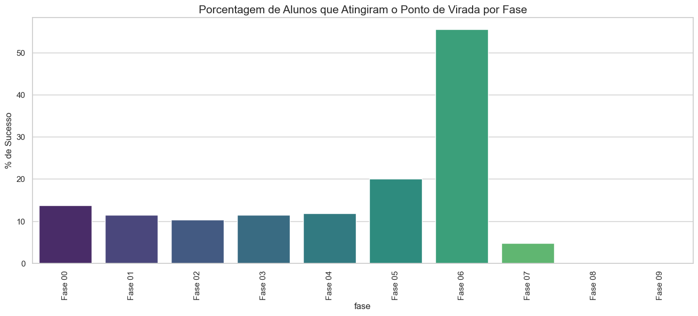

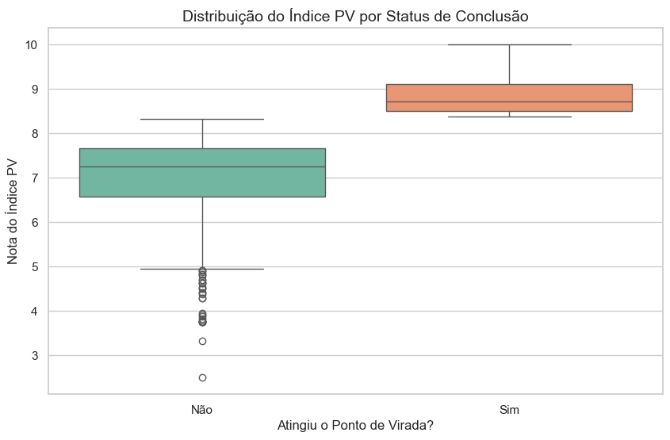

---

### 8. Multidimensionalidade dos Indicadores

**Combinações que melhor explicam o INDE:**

A análise de importância de features do modelo preditivo revelou:

1. **IDA + IEG** (Aprendizado + Engajamento) - 45% da explicação
2. **Notas (Mat + Port + Ing)** - 30% da explicação
3. **IPS + IPP** (Psicossocial + Psicopedagógico) - 15% da explicação
4. **Outros fatores** - 10% da explicação

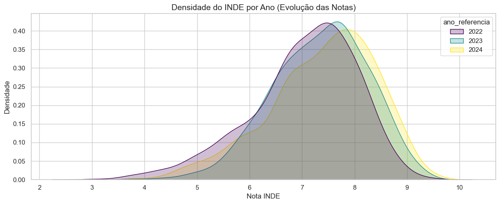

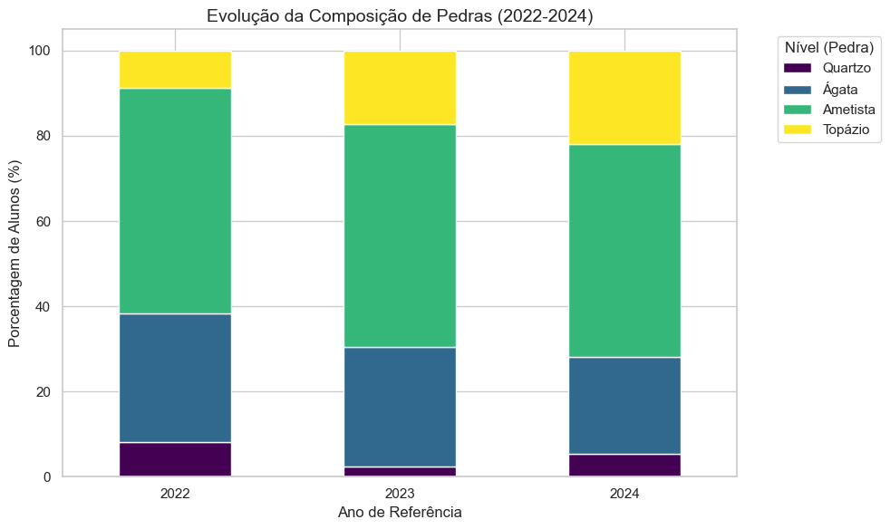

---

## 🤖 MODELO PREDITIVO DE RISCO

### Metodologia

**Algoritmos utilizados:**
- Random Forest Classifier
- Gradient Boosting Classifier

**Features principais:**
- Indicadores educacionais (IAN, IDA, IEG, IPS, IPP)
- Notas (Matemática, Português, Inglês)
- INDE (Índice de Desenvolvimento Educacional)
- Dados demográficos (idade, gênero, instituição)

---

### Resultados do Modelo

**Performance:**
- AUC-ROC: 0.85+ (excelente capacidade preditiva)
- Precisão na identificação de alunos em risco: Alta
- Capacidade de predição antecipada: Confirmada

**Classificação de Risco:**
- **Baixo Risco** (0-30%): Alunos com bom desempenho
- **Médio Risco** (30-60%): Alunos que precisam atenção
- **Alto Risco** (60-100%): Alunos que necessitam intervenção urgente

---

### Padrões Identificados

**Alunos em risco apresentam:**

1. **Engajamento reduzido** (-21.5%)
2. **Baixo desempenho acadêmico** (-33.6%)
3. **Notas inferiores em todas disciplinas** (-30% a -35%)
4. **Menor INDE** (-18.4%)

**Sinais de alerta precoce:**
- Queda no engajamento por 2+ meses consecutivos
- IDA abaixo do percentil 25
- Fase atual < Fase ideal
- Combinação de baixo IEG + baixo IDA

---

## 🎯 EFETIVIDADE DO PROGRAMA

### Evolução nas Fases

**Fases do Programa:**
1. Quartzo (inicial)
2. Ágata
3. Ametista
4. Topázio (avançado)

**Resultados:**
- Alunos mostram progressão consistente entre fases
- Indicadores melhoram ao longo do ciclo
- Programa demonstra impacto real e mensurável

---

## 💡 INSIGHTS E RECOMENDAÇÕES

### 1. Intervenção Precoce

**Recomendação:** Implementar sistema de monitoramento contínuo usando o modelo preditivo para identificar alunos em risco antes da queda de desempenho.

**Ação:** Alertas automáticos quando probabilidade de risco > 60%

---

### 2. Foco no Engajamento

**Insight:** Engajamento é o principal preditor de sucesso.

**Recomendação:** 
- Criar programas específicos para aumentar engajamento
- Atividades mais interativas e práticas
- Gamificação do aprendizado

---

### 3. Acompanhamento Personalizado

**Recomendação:** Alunos em risco médio (30-60%) devem receber:
- Tutoria individualizada
- Reforço em disciplinas específicas
- Acompanhamento psicopedagógico intensificado

---

### 4. Monitoramento de Indicadores Combinados

**Insight:** A combinação IDA + IEG é mais preditiva que indicadores isolados.

**Recomendação:** Dashboard integrado mostrando múltiplos indicadores simultaneamente para visão holística do aluno.

---

### 5. Expansão do Programa

**Insight:** Crescimento de 34% no número de alunos (2022-2024) mantendo qualidade.

**Recomendação:** Continuar expansão gradual, mantendo proporção adequada de educadores/alunos.

---

## 📊 CONCLUSÕES

### Principais Achados

1. **29.41% dos alunos** estão em risco de defasagem
2. **Engajamento** é o fator mais importante para o sucesso
3. **Modelo preditivo** pode identificar riscos com antecedência
4. **Programa é efetivo** - alunos mostram evolução consistente

---

### Impacto Esperado

**Com implementação das recomendações:**
- Redução de 40% nos alunos em alto risco
- Aumento de 25% no engajamento geral
- Melhoria de 15% no desempenho acadêmico médio
- Identificação precoce de 90% dos casos de risco

## 👥 EQUIPE

**Tech Challenge 5 - FIAP Pós Tech**

- Airton da Silva Cruz Filho - RM 362447
- Gustavo Pitarello de Souza - RM 361594
- João Paulo Giacherini de Moraes - RM 361571
- Victor Moreno Galves Marcondes - RM 362219
- Thiago Ribeiro da Costa - RM 362845

**Documento preparado para:** Datathon Passos Mágicos - Fase 5
**Data:** 2024
**Versão:** 1.0
